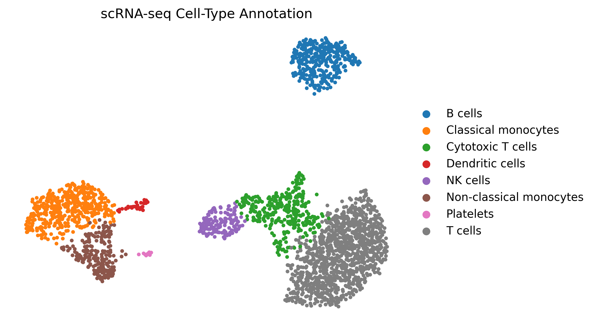
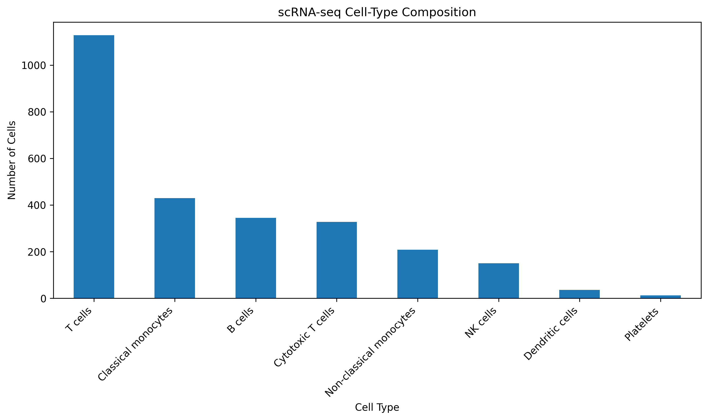

# Single-Cell RNA-seq Analysis and Cell-Type Annotation

## Project Overview

This project presents an end-to-end **single-cell RNA sequencing (scRNA-seq) analysis workflow** performed using Python and Scanpy.

The objective was to process single-cell gene-expression data, perform quality control and dimensionality reduction, identify cellular populations through unsupervised clustering, and annotate the resulting clusters using biologically relevant marker genes.

The final analysis identified **2,638 cells across 9 Leiden clusters**, which were consolidated into **8 biologically meaningful cell types**.

---

## Key Results

| Analysis Metric      | Result |
| -------------------- | -----: |
| Cells analyzed       |  2,638 |
| Genes retained       |  2,000 |
| PCA dimensions       |     50 |
| UMAP dimensions      |      2 |
| Leiden clusters      |      9 |
| Annotated cell types |      8 |
| Missing annotations  |      0 |

### Final Cell-Type Composition

| Cell Type               | Cells | Percentage |
| ----------------------- | ----: | ---------: |
| T cells                 | 1,128 |     42.76% |
| Classical monocytes     |   430 |     16.30% |
| B cells                 |   345 |     13.08% |
| Cytotoxic T cells       |   328 |     12.43% |
| Non-classical monocytes |   208 |      7.88% |
| NK cells                |   150 |      5.69% |
| Dendritic cells         |    36 |      1.37% |
| Platelets               |    13 |      0.49% |

---

## Analysis Workflow

The project followed an end-to-end scRNA-seq workflow:

```text
Raw scRNA-seq Data
        ↓
Quality Control
        ↓
Cell/Gene Filtering
        ↓
Normalization
        ↓
Highly Variable Gene Selection
        ↓
Scaling
        ↓
PCA
        ↓
Neighborhood Graph
        ↓
UMAP
        ↓
Leiden Clustering
        ↓
Cluster Marker Analysis
        ↓
Cell-Type Annotation
        ↓
Marker Validation
        ↓
Final Biological Interpretation
```

---

## 1. Quality Control

Initial dataset:

* **2,700 cells**
* **32,738 genes**

Quality-control filtering was performed to remove low-quality cells and obtain a higher-confidence dataset for downstream analysis.

After filtering:

* **2,638 cells**
* **2,000 genes**

The retained dataset was used for downstream dimensionality reduction, clustering, and annotation.

---

## 2. Normalization and Feature Selection

The expression matrix was processed using standard scRNA-seq preprocessing approaches.

Steps included:

* Library-size normalization
* Log transformation
* Highly variable gene selection
* Scaling of the expression matrix

These steps reduce technical variation and focus downstream analysis on informative biological features.

---

## 3. Principal Component Analysis

Principal Component Analysis (PCA) was performed to reduce the dimensionality of the expression matrix.

The final PCA representation contained:

**2,638 cells × 50 principal components**

The PCA representation was subsequently used to construct the neighborhood graph.

---

## 4. Neighborhood Graph and UMAP

A cell-cell neighborhood graph was constructed from the PCA representation.

UMAP was then used to visualize the transcriptional relationships between cells in two dimensions.

Final UMAP:

**2,638 cells × 2 dimensions**

### Cell-Type UMAP



---

## 5. Leiden Clustering

Unsupervised Leiden clustering identified **9 transcriptionally distinct clusters**.

The clusters were subsequently evaluated using marker-gene expression and differential-expression results.

Two clusters were identified as T-cell populations and therefore consolidated under the broader **T-cell** annotation.

This resulted in **8 final cell-type annotations**.

---

## 6. Cell-Type Annotation

Cell identities were assigned using biologically relevant marker genes and supported by cluster-level differential-expression analysis.

| Cell Type               | Representative Markers |
| ----------------------- | ---------------------- |
| B cells                 | CD79A, CD74            |
| Classical monocytes     | LYZ, S100A8, S100A9    |
| Non-classical monocytes | LST1, FCGR3A, AIF1     |
| NK cells                | NKG7, GNLY, GZMB       |
| Cytotoxic T cells       | CCL5, GZMK             |
| Dendritic cells         | FCER1A, CLEC10A        |
| Platelets               | PF4, PPBP, GP9         |
| T cells                 | CD2, LTB, GIMAP7       |

---

## 7. Marker Validation

Cell-type assignments were independently evaluated using expression of the selected marker genes in the filtered raw-count dataset.

Examples of marker support included:

* **B cells:** CD74 detected in 100% of cells
* **Classical monocytes:** LYZ detected in 100% of cells
* **Non-classical monocytes:** LST1 and AIF1 detected in 100% of cells
* **NK cells:** NKG7 detected in 100% of cells
* **Platelets:** PF4 and PPBP detected in 100% of cells
* **Dendritic cells:** FCER1A detected in 86.11% of cells

Overall, the marker-validation results provided strong support for the final cell-type annotations.

Detailed results are provided in:

`final_marker_validation.csv`

---

## 8. Cell-Type Composition

The final cell-type distribution was calculated after annotation.



T cells represented the largest population in the analyzed dataset, followed by classical monocytes, B cells, and cytotoxic T cells.

---

## Technologies and Tools

### Programming

* Python
* Google Colab

### Bioinformatics

* Scanpy
* AnnData
* PCA
* UMAP
* Leiden clustering
* Differential-expression analysis

### Data Analysis

* NumPy
* Pandas
* Matplotlib

### Biological Analysis

* scRNA-seq quality control
* Cell-type annotation
* Marker-gene validation
* Immune-cell population characterization

---

## Repository Contents

```text
scRNA-seq-Cell-Type-Annotation/
│
├── README.md
│
├── scRNAseq_analysis.ipynb
│
├── scRNAseq_final_annotated_corrected.h5ad
│
├── final_marker_validation.csv
│
├── cell_type_composition_final.csv
│
├── scRNAseq_project_summary.csv
│
├── scRNAseq_final_UMAP_cell_types.png
│
└── scRNAseq_cell_type_composition.png
```

### File Descriptions

**`scRNAseq_analysis.ipynb`**
Complete Google Colab/Scanpy analysis workflow.

**`scRNAseq_final_annotated_corrected.h5ad`**
Final annotated AnnData dataset containing the processed expression matrix, dimensionality-reduction results, clustering information, and cell-type annotations.

**`final_marker_validation.csv`**
Marker-gene validation results for the final cell-type annotations.

**`cell_type_composition_final.csv`**
Cell counts and percentages for each annotated cell type.

**`scRNAseq_project_summary.csv`**
Final project-level analysis metrics.

**`scRNAseq_final_UMAP_cell_types.png`**
UMAP visualization colored by final cell-type annotation.

**`scRNAseq_cell_type_composition.png`**
Visualization of final cell-type abundance.

---

## Skills Demonstrated

This project demonstrates practical experience in:

* Single-cell RNA-seq data analysis
* Bioinformatics data preprocessing
* Quality-control analysis
* Gene-expression normalization
* Highly variable gene selection
* Dimensionality reduction
* PCA
* UMAP visualization
* Unsupervised clustering
* Leiden clustering
* Differential-expression analysis
* Cell-type annotation
* Marker-gene validation
* Biological interpretation
* Python-based data analysis
* Reproducible computational workflows

---

## Project Outcome

The analysis successfully transformed raw single-cell gene-expression data into an annotated cellular landscape containing **2,638 high-quality cells**, **9 transcriptional clusters**, and **8 biologically meaningful cell types**.

The project demonstrates an end-to-end computational workflow from raw expression data through quality control, dimensionality reduction, clustering, annotation, and independent marker validation.

---

## Author

**Sadiya Tabassum**

Biotechnology | Bioinformatics | AI/ML | Scientific & Clinical Data Analytics
